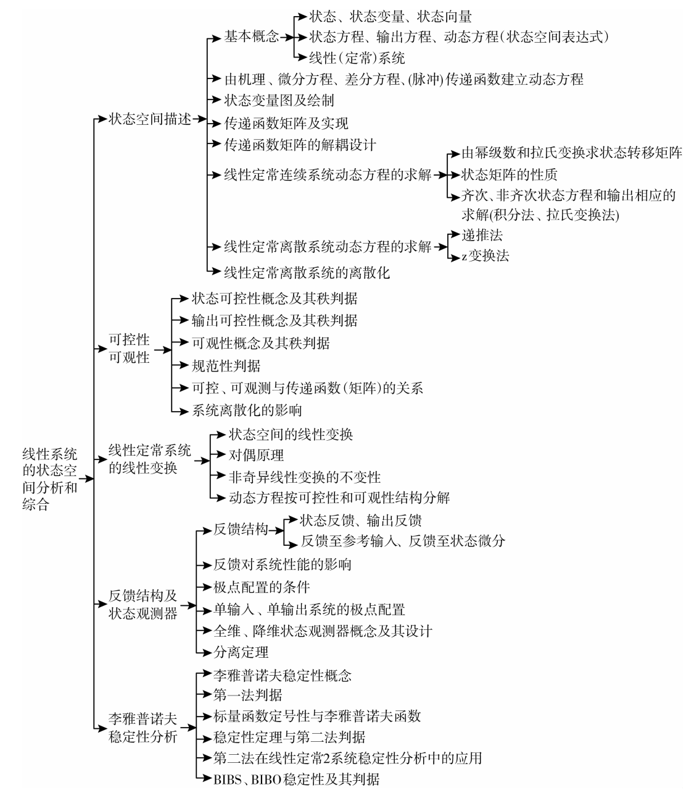

# 现代控制理论

## 现代控制整体脉络结构

## 参考资料

1. [视频：B站 埃得加Edgar](https://space.bilibili.com/276472163?spm_id_from=333.337.search-card.all.click)
2. [视频：B站 DR_CAN](https://space.bilibili.com/230105574?spm_id_from=333.337.search-card.all.click)
3. [书籍：胡寿松 自动控制原理](https://baike.baidu.com/item/%E8%87%AA%E5%8A%A8%E6%8E%A7%E5%88%B6%E5%8E%9F%E7%90%86%EF%BC%88%E7%AC%AC%E4%B8%83%E7%89%88%EF%BC%89/53605016)
4. [书籍：王天威 控制之美](https://book.douban.com/subject/35934779/)

## 版权声明

本笔记内容为开源项目，非盈利，旨在分享和传播知识，所有资料均来自网络公开资源，作者不对内容的准确性、完整性和时效性作任何明示或暗示的保证。本笔记仅供学习和研究使用，不得用于任何商业目的。

作者尊重原作者的版权，若内容涉及您的版权，请及时联系作者删除或更正相关内容。任何人可自由引用、复制、分发或修改本笔记的内容，但请注明出处并遵循相同的开源协议。